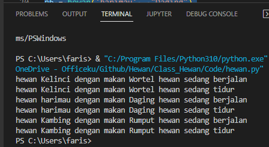

## Class dan Object menggunakan bahasa pemrograman python
<b> Cara Mendefinisikan Kelas dengan Python </b> </p>
Untuk membuat class di python di awali dengan class nama_class perhatikan sample di bawah ini : </p>

```python
class hewan:
```
</p>

<b> Atribut Instance </b></p>
Semua kelas membuat objek, dan semua objek berisi karakteristik yang disebut atribut . Gunakan metode <b> __init __ () </b> untuk menginisialisasi atribut awal objek dengan memberinya nilai default. Perhatikan sample di bawah ini: </p>

```python
def __init__(self, nama, makan):
        self.nama = nama
        self.makan = makan

```
</p>
Dalam kasus <b> class hewan() </b>, setiap hewan memiliki nama dan makan tertentu, yang jelas penting untuk diketahui ketika Anda mulai benar-benar menciptakan hewan yang berbeda. Ingat: <b> "kelas hanya untuk mendefinisikan hewan, tidak benar-benar membuat turunan hewan individu dengan nama dan makan tertentu". </b> </p>

<b> Class Attributes </b> </p>
Atribut instance spesifik untuk setiap objek, atribut class adalah sama untuk semua instance — yang dalam hal ini adalah semua hewan. Perhatikan kode di bawah ini : </p>

```python
class hewan:
  def __init__(self, nama, makan):
        self.nama = nama
        self.makan = makan

  def berjalan (self):
    print('hewan' , self.nama , 'dengan makan' , self.makan , 'hewan sedang berjalan')
    
  def tidur (self):
    print('hewan' , self.nama , 'dengan makan' , self.makan , 'hewan sedang tidur')

```
</p>
Jadi, setiap hewan memiliki nama dan makan yang unik. </p>

<b> Instantiating Objects </b></p>
Perhatikan kode di bawah ini : </p>

```python
class hewan:
  def __init__(self, nama, makan):
        self.nama = nama
        self.makan = makan

  def berjalan (self):
    print('hewan' , self.nama , 'dengan makan' , self.makan , 'hewan sedang berjalan')
    
  def tidur (self):
    print('hewan' , self.nama , 'dengan makan' , self.makan , 'hewan sedang tidur')

p5 = hewan('Kelinci' , "Wortel")
p6 = hewan('Harimau' , "Daging")
p7 = hewan('Kambing' , "Rumput")
    
p5 = hewan('Kelinci' , "Wortel")
p5.berjalan ()
p5.tidur ()

p6 = hewan('harimau' , "Daging")
p6.berjalan()
p6.tidur()

p7 = hewan('Kambing' , "Rumput")
p7.berjalan()
p7.tidur()

```
</p>
<b> hasil akhirnya seperti di bawah ini : </b></p>

 </p>

